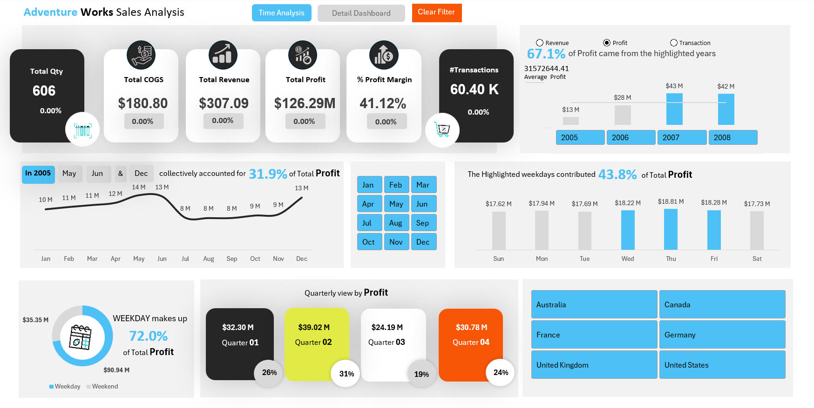
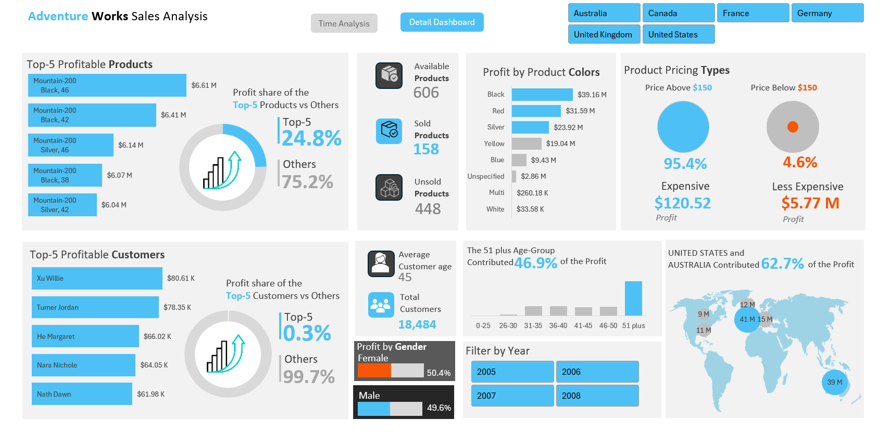

# AdventureWorks Sales Performance Analysis (Excel Dashboard)

## 📌 Business Context
AdventureWorks is a retail company selling products across multiple regions and categories.
Sales leadership requires a consolidated and easy-to-understand view of historical sales data
to monitor revenue trends, identify top-performing products, and evaluate regional performance.

This Excel dashboard was developed as a **business decision-support tool** to help
sales managers and stakeholders quickly understand performance drivers and take data-driven actions.

---

## 🎯 Project Objectives
- Analyze overall sales performance over time
- Identify top-performing product categories
- Evaluate regional contribution to total revenue
- Understand customer purchasing patterns
- Provide an interactive dashboard for quick business insights

---

## ❓ Business Questions Answered
- How is total sales trending over time?
- Which product categories generate the highest revenue?
- Which regions contribute most to overall sales?
- Who are the top customers by sales value?
- How does order quantity vary across products and regions?

---

## 🗂 Dataset Overview
- **Dataset Name:** AdventureWorks Sales Data
- **Data Type:** Historical sales transaction data
- **Key Fields:**
  - Order Date
  - Product Category
  - Product Name
  - Sales Amount
  - Order Quantity
  - Region
  - Customer Name

---

## 📊 Key Metrics Used
- **Total Sales** – measures overall revenue performance
- **Sales by Category** – identifies high-performing product groups
- **Sales by Region** – evaluates regional contribution
- **Order Quantity** – indicates demand patterns
- **Top Customers** – supports customer prioritization

---

## 📈 Dashboard Overview
The Excel dashboard presents sales insights using:
- Pivot Tables
- Pivot Charts
- Slicers for interactivity

Users can dynamically filter data by:
- Product Category
- Region
- Time Period

This enables quick exploration of trends and performance drivers without writing queries.

---

## 🔍 Key Insights
- A small number of product categories contribute a significant share of total revenue
- Certain regions consistently outperform others in sales contribution
- Sales exhibit noticeable seasonal trends
- Top customers account for a large portion of overall revenue

---

## 📌 Business Decisions Supported
- Focus marketing efforts on high-revenue product categories
- Allocate inventory based on regional demand patterns
- Plan promotions during peak sales periods
- Strengthen engagement with high-value customers

---

## 💼 Business Impact
- Provides sales leadership with a quick performance snapshot
- Enables faster and more informed decision-making
- Reduces dependency on manual reporting
- Supports strategic sales planning and forecasting

---

## 🛠 Tools & Skills Used
- Microsoft Excel
- Pivot Tables & Pivot Charts
- Slicers & Filters
- Data Cleaning & Preparation
- Dashboard Design
- Business Analysis

---

## 🧠 Key Learnings
- Translating raw sales data into meaningful business insights
- Designing dashboards focused on decision-making
- Using Excel as a business intelligence tool rather than just a spreadsheet
- Communicating insights clearly to non-technical stakeholders
---

## 📈 Dashboard Views
- **Time Analysis Dashboard:** Yearly, monthly, and weekday performance trends.  
- **Detail Dashboard:** Product profitability, customer demographics, and regional analysis.  

---

### 🖼️ Dashboard Previews

## 🎥 Dashboard Demo Video

Watch the demo here:  
[AdventureWorks Sales Dashboard Demo](Video/Adventurework_Sales_Dashboard.mp4)
